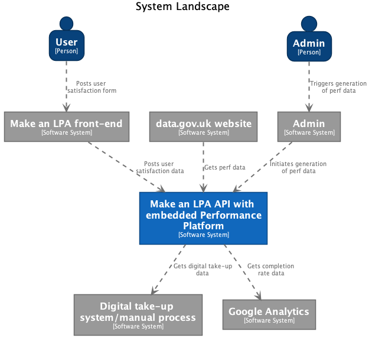
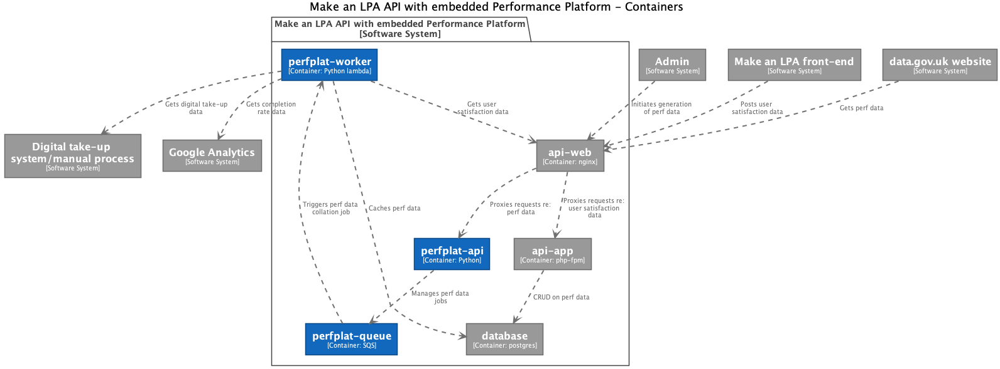

# 0007. Performance Data Platform

Date: 2021-09-06

## Status

* Proposed (2021-06-16)
* Rejected partially (2022-09-26)

After discussions in the team, we decided to scale this back considerably to
just a feedback form running as a Python Flask application alongside our PHP app.
This just records user satisfaction scores. The more complex infrastructure
(SQS queues, lambdas etc.) were replaced with a simpler docker-based approach.

## Context

We have a requirement to publish data about the performance of the
Make an LPA service. The key pieces of data we must publish are:

* **User satisfaction:** Ratings of the service provided by users on a 5 point scale,
  from "very dissatisfied" to "very satisfied". This is currently collected through
  a [centralised government feedback page](https://www.gov.uk/done/lasting-power-of-attorney).
* **Completion rate:** Percentage of transactions started on the service by users
  which are subsequently completed. We derive this from Google Analytics and
  the database.
* **Digital take-up:** Number of users using the online service as a percentage of
  users across all channels (online + paper + phone etc.). There is no API for this
  presently.

Currently, this data is being manually collated. We need to find a more efficient
and accurate way of publishing it.

As a side objective, this is a greenfield project which gives us an opportunity
to test the waters of our proposed new technology stack
(see [0006-modernise-the-code-base](./0006-modernise-the-code-base.md)).

## Decision

### Data sources

We agreed the following sources for the data:

1. **User satisfaction:** To be collected by us through a new feedback form, based on
   the existing central form.
2. **Completion rate:** We propose to calculate this by counting the number of
   LPA applications which reach a "created" state. We propose not to count
   applications completed within a session (i.e. user logs in, starts an application,
   and completes it). Rather, we would count the applications completed by day,
   regardless of when they were started (e.g. user logs in on Monday, starts an
   application, and completes it on Thursday: it's added to the "completed"
   pile for Thursday).
3. **Digital take-up:** We will request a new endpoint on the Sirius data API to
   provide this data. Investigation showed that this data is currently manually
   collected from Sirius (OPG's case management system) through the client
   application, so we believe that Sirius has the data we need.

### High-level architecture

We agreed that an **embedded** design for the solution's high-level architecture was preferable:

(The above diagrams use the [C4 model](https://c4model.com/).)

This re-uses parts of the existing stack to implement ingress and storage for the data platform,
in particular:

* The data platform API (which accepts requests to generate the performance data) is
  positioned behind the api-web proxy currently used by api-app.
* The data platform worker (which aggregates the performance data) and API write to the existing
  postgres database, albeit into new table(s).

The contrasting approach we discussed was a **standalone** one. Using this approach, we would
implement the entire data platform in isolation from the existing application: we would have
a separate database to store its data, and traffic in to the platform would be separate from
traffic intended for other components, for example:

* The data platform has its own proxy which forwards requests to the API.
* The API and the worker process write to a separate database.

We decided the latter would add unnecessary complexity, as we would need more
ingress rules for the API, extra Terraform/scripting to provision the additional database,
and a new load balancer/proxy. This would be a lot of work and expense for a relatively simple service.
(In some respects, the proposed architecture is a little over the top; but part of the reason for that
is to provide a gateway into a more modern architecture over the long term.)

### Implementation approach

After agreeing on an embedded archtitecture, we also agreed the following approach to implementation:

* We will implement the data platform in Python, using AWS lambdas to run the worker and API.
* We will use a queue-based workflow, where we add a job to generate the perf data and notify
  clients when it is ready. We agreed that SQS was a good choice of queuing technology.
* We will not merge the user satisfaction data into the existing feedback table,
  but will store it in a separate table in the PostgreSQL database.
* We’ll manage the new table, likely using SQLAlchemy, possibly with Alembic for migrations.
* We'll provide an interface in the admin UI which enables admin users to view “end of journey”
  user satisfaction data. This could either be in parallel with the existing feedback view,
  or integrated with it (by merging data from the two tables into one view). This is
  to be decided by the product team.
* We'll gather user satisfaction data inside front-app initially, using a PHP form
  based on the existing centralised feedback form. This will post to the new API (in Python).
  Longer term, this would be a good test case for migrating our PHP app to microfrontend
  slices: as the user satisfaction form needs no authentication, it would be a good place to
  insert a first Python UI application into our infrastructure.
* We generally agreed to the system landscape and container structure shown in the diagrams above.
  Note that a “container” in these diagrams doesn’t necessarily mean a docker container:
  it’s just a logical unit in the C4 level 2 (container) model diagram. These would be
  lambdas running under Docker or localstack in dev, but native lambdas (either pure code
  or lambda-ised containers) in live.

## Consequences

Cons:

* This is quite a bit of work to replace a manual process which isn't overly onerous. It feels
  a bit like overkill, given the complexity required to replace that process.

Pros:

* The data platform will turn the manual performance data gathering process into an automated process,
  reducing overhead. While this increases work in the short term, it sets us up for better data
  publication over the longer term.
* The data platform will make our data available in an easily-digested, accessible form which can be
  requested on demand by other services, such as [data.gov.uk](https://data.gov.uk/).
* Automation will reduce the potential for human error.
* Documenting the assumptions and process behind data gathering makes it transparent to stakeholders.
