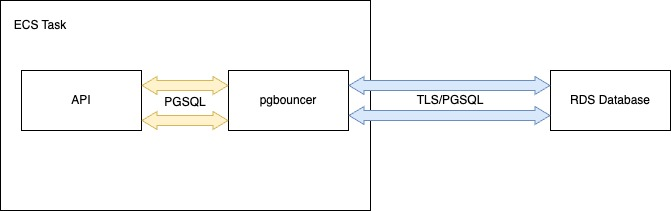

# 0013. Implement a Postgres connection pool

Date: 2023-04-13

## Status

* Proposed (2023-04-13)

## Context

Every time a request is made to the API, a new connection is opened to the database. These connections are not reused between requests. This is a problem because the overheads of opening a new connection (viz. TCP handshake, TLS handshake, RDS process forking etc.) are non-trivial and add unnecessary latency to the request. The actual query time is often dwarfed by the connection overheads.

## Proposal

By implementing a connection pool, the API will connect to the connection pool instead of the database. The connection pool will then open a connection to the database (if such a connection does not already exist), and reuse it for subsequent requests. This will reduce the overheads of opening a new connection, and will allow us to serve more requests per second.

We should use the [pgbouncer](https://www.pgbouncer.org/) connection pooler. This is a mature, well-tested and widely-used connection pooler that is well-suited to our needs.

We should configure pgbouncer to use the [session pooling](https://www.pgbouncer.org/features.html#session-pooling) mode. This will allow us to reuse connections between requests, but will also ensure that each request is executed in its own session. This is important because we want to ensure that each request is isolated from other requests, and that the database is left in a consistent state after each request.

TLS will be enabled for connections between the connection pooler and RDS. TLS will not be enabled on the connection pooler's listening port, as traffic to the connection pooler will be local to the ECS task. This will reduce the overheads by removing the need for some TLS handshakes and reduce configuration complexity as we will not need to configure TLS certificates for the connection pooler.

### Implementation

The connection pool will be implemented as a sidecar container in the API's ECS task definition, allowing us to run the connection pooler in the same task as the API, but in a separate container. This will reduce the latency of requests to the connection pooler, as the connection pooler will be running on the same host as the API.

The connection pool will be configured to connect to the database using the normal database credentials. The connection pool will be configured to listen on a local port (TCP/6432 so that it's clear at a glance that it's not connecting directly to RDS to people who are not familiar with the Make service), and the API will be configured to connect to the connection pooler on this port.

## Considerations

- Adding any additional components to the service increases the complexity of the service, and increases the number of components that can fail. This is a trade-off that we need to consider when implementing the connection pool.
- The additional attack surface of the connection pooler is a potential security concern. However, the connection pooler will only be accessible from within the ECS task, and will not be exposed to the public internet.
- The connection pooler will add additional overheads to the request path. However, the overheads of opening a new connection are much higher than the overheads of the connection pooler, so the connection pooler will reduce the overall latency of requests.
- Connection sharing between requests is a potential security concern so the connection pooler must be properly configured to ensure that it does not interfere with the isolation of requests. Pgbouncer is a mature and well-tested product, so we should be able to rely on its documentation and community to ensure that it is configured correctly.
- The connection pooler is another component that will need to be monitored, maintained and updated.
- Because this will run as a sidecar container, it will take some of the resources that would otherwise be available to the API. However, the connection pooler is a lightweight process, and prelimary testing shows that memory and CPU usage should not be significant.
