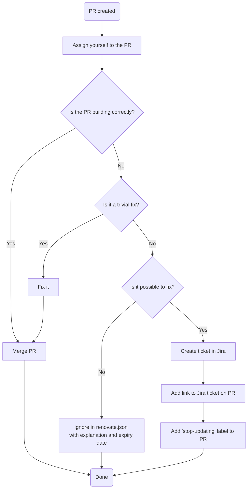

# 0014. Implement process for handling Renovate PRs

Date: 2025-10-14

## Status

Accepted

## Context

We need a clear process for handling Renovate PRs. Our goals are to:

- Reduce duplicative effort
- Have no undue friction to merging changes
- Clearly document which upgrades are blocked and why

## Decision

We will implement the following workflow:

## Consequences

This workflow ensures everyone can see who has picked up the work, and introduces a clear workflow for documenting and tracking complicated updates in Jira. Simple updates be merged with minimal effort.

Expiry dates in renovate.json will need to be checked to avoid temporary ignores being forgotten about and made permanent.
