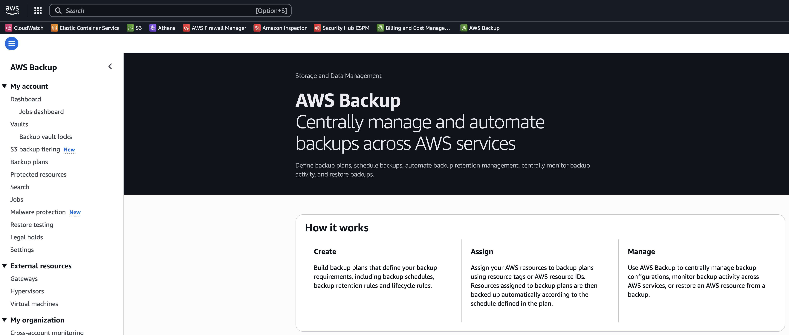
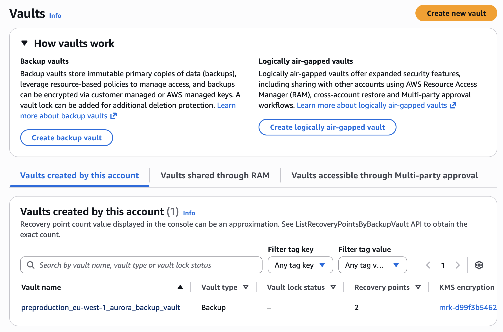
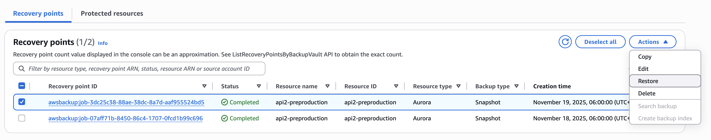
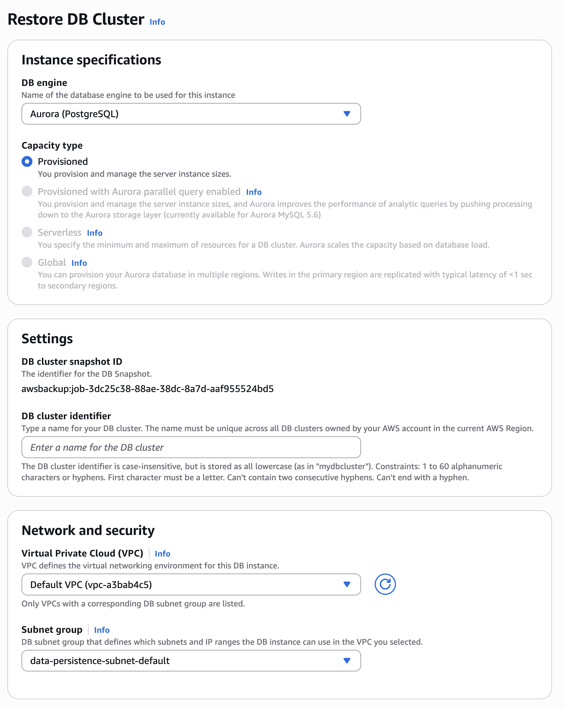
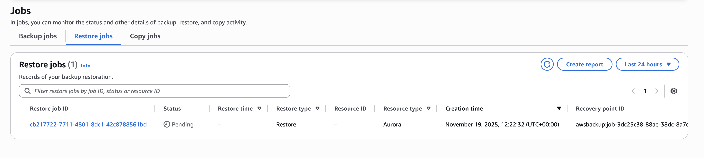
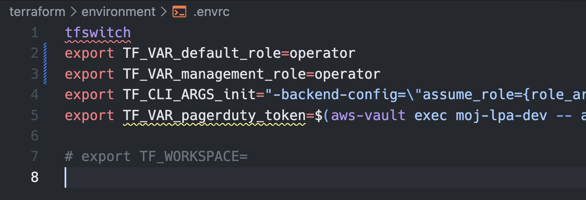

# Restoring an Aurora Cluster from a backup

AWS Backup is used to schedule and manage backups for the `api` Aurora Cluster.

As with other AWS backup processes, restored backups create a new resource which must be named differently from the source resource. If the source were deleted prior to restoration this would not be an issue, but this comes with risk.

This document will walk you through how to restore a backup, and bring it into service, and how to delete the old table.

The guide is targetted at Production restoring a backup of the api cluster table, but the screenshots are from Preproduction.

This guide focusses on using the AWS console.

## Prerequisites

- You must be able to assume the correct roles for this activity.
- Development and Preproduction requires the `breakglass` role.
- Production requires the `data-access` role.
- This procedure requires pairing. This is to help validate each step is completed correctly and have more of the team comfortable with the procedure.
- It is strongly recommended that the service is put into maintenance mode to prevent users entering data that will be lost. Customer data entered since the last backup will also be lost.
- We will need to initiate a Change Freeze when we are ready to bring the restored tables into the service. During this time, any run of the path to live pipeline risks deleting the restored or outgoing tables. The freeze will help to prevent this.
- This restore procedure can take hours to perform.
- You will need the image tag currently deployed to production

## Restore a table from a backup

1. Sign in to the AWS Console, Assume the `breakglass` role in the Production account, and navigate to AWS Backup.

<!-- Center align -->
<div align="left">
  
</div>

2. From the menu on the left, expand My account and click on Backup Vaults.

3. Click on the vault named `production_eu-west-1_aurora_backup_vault`.

<div align="left">
  
</div>

4. This will show a list of backups for that cluster that can be used as recovery points.

5. We will select a single backup using the `Resource ID` and `Creation time` to pick one that is appropriate, and tick it.

> You can only restore one backup at a time, so pick only one and repeat the process.

6. At the top right of this table, click the `Actions` dropdown and choose `Restore`.

<div align="left">
  
</div>

7. This will open the Restore backup wizard.

<div align="left">
  
</div>

8. You must choose a new name for the cluster. Use the original name plus a `-` then the date of restoration in the format `YYYYMMDD`, then a `-` and the `environment name`. For example `api-20251128-production`. This will make is easier to manage restored clusters going forward.

9. It is not possible to change the name of a Aurora cluster after it is created. This new name will be brought into our infrastructure as code.

10. Select the `Default role` as the `Restore role` and click `Restore backup`.

<div align="left">
  
</div>

11. You’ll be taken to the `Jobs` page on the `Restore jobs` tab.

<div align="left">
  
</div>

12. Restore jobs can take a long time (hours) to complete.

## Bring restored table into service

1. Here we will update the infrastructure as code to use the new restored table.

2. Ensure you are up to date with the main branch.

```sh
git checkout main
git pull
```

3. In terminal, navigate to the Terraform environment configuration and select the production workspace

```sh
cd terraform/environment
aws-vault exec identity -- terraform init
aws-vault exec identity -- terraform workspace select production
```

TODO: Update this when move the db to a shared resouce.

4. Edit the terraform/environment/.envrc file to set the TF_VAR_default_role to breakglass.

<div align="left">
  
</div>

5. update your environment variables from .envrc

```sh
direnv allow
```

or

```sh
source .envrc
```

6. Initialise the terraform configuration

```sh
aws-vault exec identity -- terraform init
```

7. Next, remove the Aurora cluster we are replacing from Terraform state. This stops terraform from managing it and makes way for us to import the new cluster.

```sh
aws-vault exec identity -- terraform state rm 'module.eu-west-1.module.api_aurora[0].aws_rds_cluster.cluster_serverless[0]'
aws-vault exec identity -- terraform state rm 'module.eu-west-1.module.api_aurora[0].aws_rds_cluster_instance.serverless_instances[0]'
aws-vault exec identity -- terraform state rm 'module.eu-west-1.module.api_aurora[0].aws_rds_cluster_instance.serverless_instances[1]'
aws-vault exec identity -- terraform state rm 'module.eu-west-1.module.api_aurora[0].aws_rds_cluster_instance.serverless_instances[2]'
```

8. Next import the restored table using the new name

```sh
aws-vault exec identity -- terraform import 'module.eu-west-1.module.api_aurora[0].aws_rds_cluster.cluster_serverless[0]' api2-20251128-production
```

9. Next, update the name of the new table in terraform.tfvars.json for the environment, for example

```json
  "accounts": {
    "production": {
      ...
      "database": {
        "database_name": "api-20251128",
        "aurora_cross_region_backup_enabled": false,
        "aurora_enabled": true,
        "aurora_instance_count": 1,
        "aurora_serverless": true,
        ...
```

10. From there we can run a plan to check what will happen.

To reduce the diff, provide the container version deployed currently to production. This can be found in the last [Github actions Path to Live run](https://github.com/ministryofjustice/opg-lpa/actions/workflows/workflow_path_to_live.yml).

```sh
aws-vault exec identity -- terraform plan -var container_version=main-v0.324.8
```

We are expecting to see updates to our restored Aurora cluster, and changes to services and resources that reference the table name or ARN.

Things to check for

```text
Policy Documents for API and Admin updating to use new (restored table)

AWS Backup managing the new table

Aurora Cluster updates and instances created

ECS Services and Task Definition updates for API and Admin

Plans and Applies always produce a Config file.

Once happy with the plan, apply the changes
```

```sh
aws-vault exec identity -- terraform apply -var container_version=main-v0.324.8
```

## Commit changes

1. Edit the terraform/environment/.envrc file to set the TF_VAR_default_role back to operator.

<div align="left">
  
</div>

2. update your environment variables from .envrc

```sh
direnv allow
```

or

```sh
source .envrc
```

3. Commit our changes to the Aurora cluster names, and raise a PR to ensure these persist.

Once this PR is merged and has reached production, we can release the change freeze.

## Deleting this old tables

At this point we can delete the old tables. They are no longer managed by Terraform, so we must do this in the AWS console.

1. In the AWS console, again while assuming the `breakglass` role in the production account, navigate to the Aurora RDS console.

2. Select `Databases` from the menu on the left.

3. Choose the old instances in the old cluster, click `Actions`, then `Delete`.

4. In the Delete instance screen, type `delete me` to permanently delete the instance and click `Delete`

5. Choose the old cluster, click `Actions`, then `Delete DB Cluster`

## End of procedure

This is the end of the proceudre
