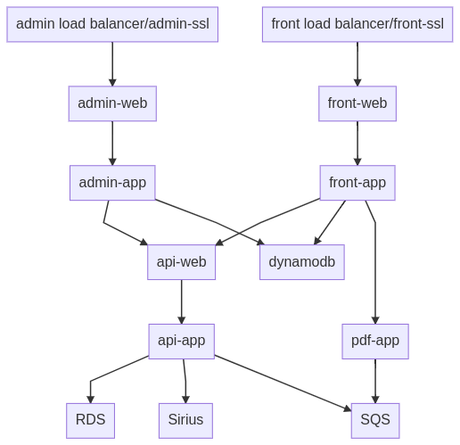

# Data flows

Preliminary efforts to document how data moves through the MaLPA stack. Please comment on/correct as you see fit.



The labels on the boxes in the diagram (roughly) correspond with the names of the containers in the `docker-compose.yml` config used to run the stack.

Code to render the above diagram in [mermaidjs](https://mermaid-js.github.io/mermaid-live-editor/#/edit/):

```
graph
  adminlb[admin load balancer/admin-ssl] --> adminweb[admin-web]
  perfplatworker --> SQS-1
  perfplatworker --> db[RDS/Postgres]
  adminweb --> adminapp[admin-app]
  adminapp --> apiweb
  adminapp --> dynamodb
  frontlb[front load balancer/front-ssl] --> frontweb[front-web]
  frontweb --> frontapp[front-app]
  frontweb --> frontappv2[front-app-v2]
  frontweb --> Redis
  frontapp --> apiweb[api-web]
  frontapp --> dynamodb
  frontapp --> pdf[pdf-app]
  pdf --> S3
  pdf --> SQS-2
  apiweb --> apiapp[api-app]
  apiapp --> db[RDS/Postgres]
  apiapp --> opgdatalpa[Sirius gateway]
  apiapp --> S3
  apiapp --> SQS-2
```

The purpose of each component in the diagram:

* admin load balancer/admin-ssl: SSL termination for admin-app. In AWS, this is a load balancer; in local dev, it's an SSL container with self-signed certs
* front load balancer/front-ssl: SSL termination for front-app. In AWS, this is a load balancer; in local dev, it's an SSL container with self-signed certs
* admin-web: nginx proxy onto admin-app
* admin-app: PHP/Laminas administrator application
* front-web: nginx proxy onto front-app and front-app-v2; traffic is split by path, so that some parts of the application are served by front-app and others by front-app-v2
* front-app: PHP/Laminas application for running the majority of the Make front-end; served via php-fpm; uses an outdated version of the GDS templates, implemented using Twig
* front-app-v2: Python/Flask application for running newer components; has no authentication yet; uses Land Registry's Jinja2 implementation of the GDS templates
* api-web: nginx proxy onto api-app
* api-app: PHP/Laminas (not MVC) application, providing authentication services and persistence for LPA form data (completed in front-app)
* pdf-app: PHP application which generates the downloadable PDF form from an LPA application and stores it in S3
* dynamodb: This is used as a lock mechanism for other containers performing migrations and seeding (to ensure database operations don't overlap with each other); and to store the system message (set in admin-app and shown in front-app). Historically, it was used for sessions, but is not any more.
* Redis: Stores PHP session data for front-app
* RDS/postgres: Back-end storage for LPA and related data. Also stores user credentials. In AWS, this is an RDS instance; in local dev, it's a PostgreSQL container
* Sirius gateway: API for accessing data about LPA applications from the Sirius case management system. Currently used to get the status of LPA applications, using the A-ref from the Make an LPA service as the reference. In dev, this is mocked out by gateway + mocksirius (see below).
* perfplat-worker: Python lambda function (running on localstack in dev and Lambda in AWS) which receives jobs triggered by placing events on the SQS-1 queue. Intended to fetch data and put it into a database. Currently proof of concept only.
* SQS-1: Queue for managing asynchronous jobs for the performance platform components. Events added to this queue trigger the perfplat-worker lambda function. Currently proof of concept only.
* SQS-2: Queue for managing PDF generation jobs. Jobs are added by api-app, then picked up and serviced by pdf-app.
* S3: Generated PDF forms are stored here for 24 hours, to be downloaded by users.

Note that this diagram excludes components which only live in CI (pipelines in CircleCI) and/or dev (your local machine):

* localstack: Mimics the functionality of AWS services (S3, lambda) in dev
* local-config: Sets up S3 buckets, dynamodb database and SQS queues in dev
* node-build-assets: Dynamically rebuilds JS and CSS in dev (if you're editing those files, this container refreshes the compiled JS/CSS as the source files change)
* mocksirius: The mock opg-data-lpa (in Prism) for dev and CI which mocks Sirius responses for cypress tests; note that we don't talk directly to Sirius in live, but go through the opg-data-lpa Sirius gateway
* gateway: An nginx container which directs traffic to mocksirius in dev and CI, appending the necessary Prism headers so that we get the right response from mocksirius
* seeding: Adds test data to the postgres db in dev
* perfplatconfig: Sets up the perfplat dev proxy locally; this is a work-around for the fact that we can't connect SQS queue events directly to a docker lambda in dev - instead, we add a proxy lambda wired up to an SQS event trigger which forwards requests onto the perfplatworker proper
