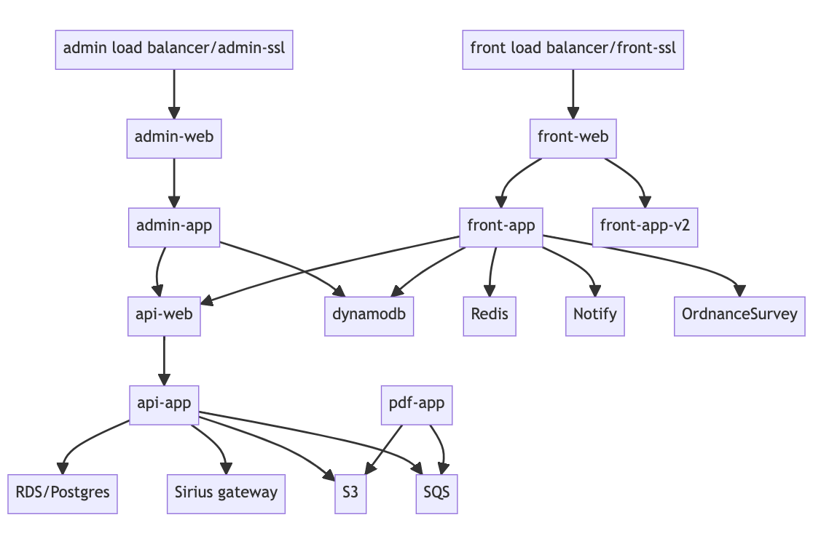

# Data flows

Preliminary efforts to document how data moves through the MaLPA stack. Please comment on/correct as you see fit.



The labels on the boxes in the diagram (roughly) correspond with the names of the containers in the `docker-compose.yml` config used to run the stack.

Code to render the above diagram in [mermaidjs](https://mermaid-js.github.io/mermaid-live-editor/#/edit/):

```
graph
  adminlb[admin load balancer/admin-ssl] --> adminweb[admin-web]
  adminweb --> adminapp[admin-app]
  adminapp --> apiweb
  adminapp --> dynamodb
  frontlb[front load balancer/front-ssl] --> frontweb[front-web]
  frontweb --> frontapp[front-app]
  frontapp --> apiweb[api-web]
  frontapp --> dynamodb
  frontapp --> pdf[pdf-app]
  pdf --> SQS
  apiweb --> apiapp[api-app]
  apiapp --> RDS
  apiapp --> Sirius
  apiapp --> SQS
```
