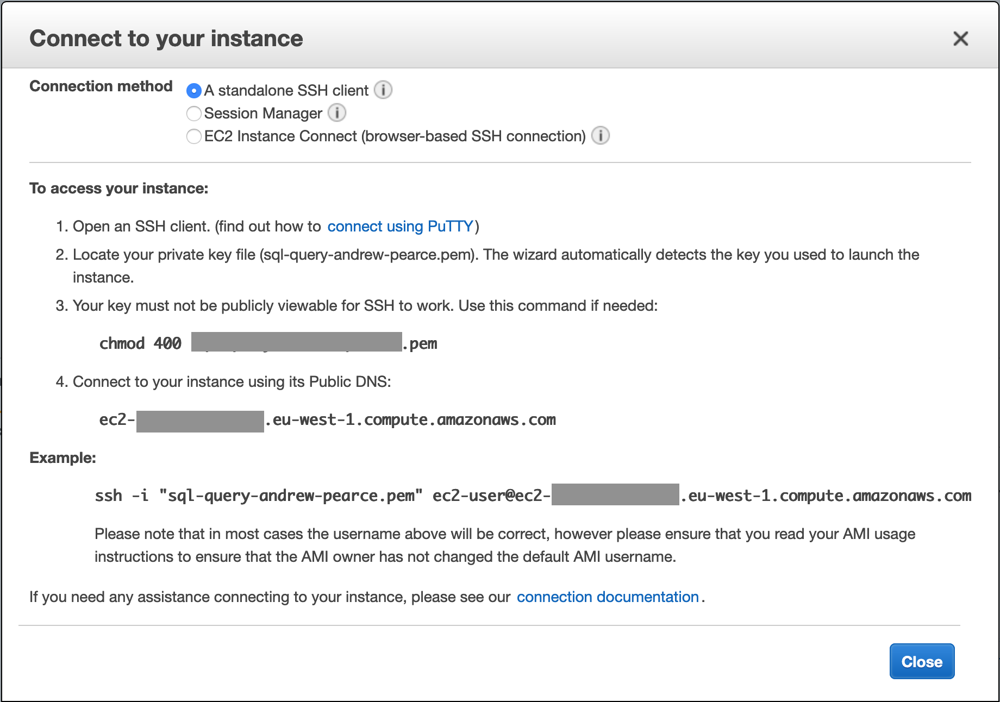

# Terminal access to databases

## Setup ec2 instance for terminal access and sql queries

You must be connected to the MoJ VPN before beginning these instructions.

1. Sign into AWS console and assume a role in the account you need that has permissions to create resources. In development this is the `operator` role.

2. Create an ec2 instance role and name it <INSTANCE-NAME>

| Parameter | Value           |
| --------- | --------------- |
| Name      | <INSTANCE-NAME> |
| Policy    | administrator   |

3. Go to the ec2 [ec2 instances page](https://eu-west-1.console.aws.amazon.com/ec2/v2/home?region=eu-west-1#Instances:sort=desc:tag:Name) and launch a new instance with the following configuration

| Parameter                     | Value                                                                        |
| ----------------------------- | ---------------------------------------------------------------------------- |
| OS                            | Amazon Linux 2                                                               |
| Type                          | T2. Medium                                                                    |
| Network                       | default vpc                                                                  |
| Subnet                        | no preference                                                                |
| Auto-assign public  IP        | Enable                                                                       |
| Placement group               | None                                                                         |
| Capacity Reservation          | None                                                                         |
| IAM role                      | None                                                                         |
| Shutdown behavior             | Terminate or Stop                                                            |
| Enable termination protection | False                                                                        |
| Monitoring                    | Enable CloudWatch detailed monitoring                                        |
| Tenancy                       | Shared                                                                       |
| Elastic Inference             | False                                                                        |
| T2/T3 Unlimited               | False                                                                        |
| User data                     | None                                                                         |
| Volumes                       | EBS, /dev/sdb, 30GiB, Delete on Termination, Encrypted, Default Key          |
| Tags                          | Name:<INSTANCE-NAME>                                                         |
| Security Groups               | Create New, Security group name <INSTANCE-NAME>, Description <INSTANCE-NAME> |
| Security Group Rule           | SSH, TCP, 22, My IP, Access via MoJ VPN only                                 |
| Key Pair                      | Create new key pair, Key pair name <INSTANCE-NAME>                           |

Download the key pair, this is your only chance to do so.

Click Launch

the ec2 instance will be starting in the [ec2 instances page](https://eu-west-1.console.aws.amazon.com/ec2/v2/home?region=eu-west-1#Instances:sort=desc:tag:Name).

___

## Connect to ec2 instance

4. Select the ec2 instance and click on Actions>Networking>Change Security Groups.

5. assign security groups to ec2 instance

| Parameter | Value                                |
| --------- | ------------------------------------ |
| Name      | rds-client-<TARGET_ENVIRONMENT_NAME> |

6. Select the ec2 instance and click Connect for the SSH client instructions to run on your machine for example,



---

## Configure ec2 instance

7. prepare and mount encrypted volume

``` bash
sudo su
lsblk
mkfs.ext4  /dev/xvdb
mkdir -p /mnt
vi /etc/fstab
(insert `/dev/xvdb /mnt ext4` )
mount -a
df -h
cd /mnt
yum remove php* -y
yum install php73 php73-pdo php73-pgsql postgresql jq git -y
amazon-linux-extras install postgresql10
```

---

## Connect to PostgreSQL

8. Set up a connection to the database by running the following commands,

``` bash
export ENV_NAME=production
export AWS_DEFAULT_REGION=eu-west-1
export API_DB_ENDPOINT=$(aws rds describe-db-instances --db-instance-identifier api-${ENV_NAME} | jq -r .'DBInstances'[0].'Endpoint'.'Address')
export DB_PASSWORD=$(aws secretsmanager get-secret-value --secret-id ${ENV_NAME}/api_rds_password | jq -r .'SecretString')
export DB_USERNAME=$(aws secretsmanager get-secret-value --secret-id ${ENV_NAME}/api_rds_username | jq -r .'SecretString')
export API_OPTS="--host=${API_DB_ENDPOINT} --username=${DB_USERNAME}"
```

9. Connect to the database

``` bash
PGPASSWORD=${DB_PASSWORD} psql ${API_OPTS} postgres
```

___

## Stopping and cleaning up ec2 instance

1. Sign into AWS console and assume a role in the account you need that has permissions to create resources. In development this is the `operator` role.

2. Go to the EC2 [ec2 instances page](https://eu-west-1.console.aws.amazon.com/ec2/v2/home?region=eu-west-1#Instances:sort=desc:tag:Name), locate the ec2 instance, select it, then click on Actions>Instance State>Terminate. Terminating the instance should prompt you to destroy the attached volumes. If not, go to [volumes](https://eu-west-1.console.aws.amazon.com/ec2/v2/home?region=eu-west-1#Volumes:sort=volumeId) select and delete them too.

3. Go to the EC2 [key pairs page](https://eu-west-1.console.aws.amazon.com/ec2/v2/home?region=eu-west-1#KeyPairs:), select the instance role created earlier, and click Delete.

4. Go to the IAM [role page](https://console.aws.amazon.com/iam/home?region=eu-west-1#/roles), select the instance role created earlier, and click Delete.

5. Go to EC2 [security groups](https://eu-west-1.console.aws.amazon.com/ec2/v2/home?region=eu-west-1#SecurityGroups:sort=tag:Name), locate the security group created earlier, select it and click Actions>Delete Security Group

